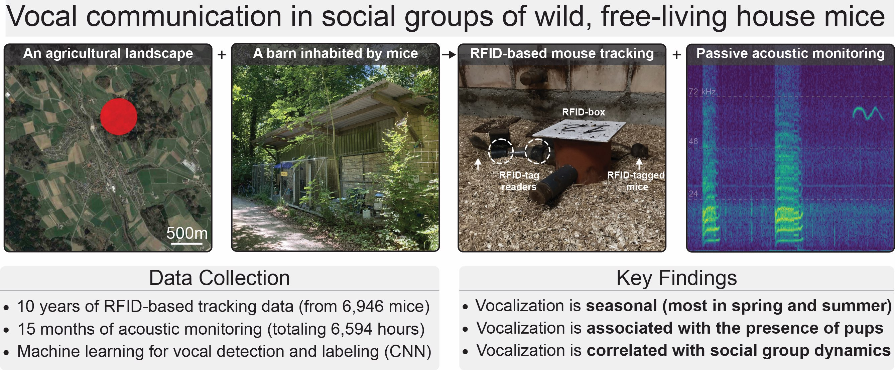

# Vocal communication in wild, free-living house mice

This repository contains code needed to reproduce figures and analyses from 

Jourjine Nicholas, Goedecker Caspar, König Barbara and Lindholm Anna K. 2025. Vocal communication is seasonal in social groups of wild, free-living house mice. Proc. R. Soc. B.29220250995 http://doi.org/10.1098/rspb.2025.0995 

## Scientific overview

The goal of this study was to better understand how acoustic communication shapes social dynamics in wild animal populations. To do this, we focused on a unique population of house mice (*Mus musculus domesticus*) living in a barn near Zürich, Switzerland. Each mouse in this population has been [RFID tagged](https://animalbiotelemetry.biomedcentral.com/articles/10.1186/s40317-015-0069-0), which allowed us to passively monitor population-wide social dynamics over long time scales (we analyzed a decade of data, from 2013-2023). Using [AudioMoth acoustic loggers](https://www.openacousticdevices.info/audiomoth), we also recorded vocalizations produced by groups of individually identifiable mice over the course of 16 months, from August 2022 to November 2023. These datasets revealed that acoustic communication in wild house mice is seasonal, with most vocalization occurring in spring and summer when mouse social groups are smallest, most dynamic, and most likely to contain pups. We also found that vocalizations are aligned in time to events that change social group membership, and are, on average, positively correlated with the strength of future social interactions between mouse pairs (i.e., how much time they spend together). These findings identify connections between acoustic communication and social dynamics in a wild animal population, and provide insight into the behavioral ecology of one of the most widely used [laboratory model organisms](https://en.wikipedia.org/wiki/Laboratory_mouse).

## How to use 

This repository contains three directories:

### 1. `notebooks`
- Jupyter notebooks for performing analyses (one per figure).

### 2. `src`
- Helper functions used within the Jupyter notebooks.

### 3. `parameters`
- Additional useful files (e.g., images) used by the notebooks to make figures.

These are intended to be used along with data at the Dryad repository [here](https://doi.org/10.5061/dryad.kprr4xhfk).

To add the data and run analyses:

1. Clone or download this repository by clicking the big green `<> Code` button above. You should get a folder called wild-mus-vocal-ecology.
2. Download the data folder [here](link), then unzip it by clicking on it, or running
    - `unzip path/to/wild-mus-vocal-ecology-data.zip` (MacOS Terminal)  
    - `Expand-Archive -Path path\to\wild-mus-vocal-ecology-data.zip -DestinationPath path\to\output-folder` (Windows Powershell) 
	
	You should end up with a folder called wild-mus-vocal-ecology-data containing three directories: "data", "models", and "annotations".  
	
3. Copy or move the contents of the wild-mus-vocal-ecology-data folder (not the folder itself) to the wild-mus-vocal-ecology folder you cloned or downloaded from this repository.  

    - To copy:  
	    MacOS Terminal:  
    	`rsync -ahP /path/to/wild-mus-vocal-ecology-data/ /path/to/wild-mus-vocal-ecology/`  
		Windows Powershell:  
	    `Copy-Item -Path "C:\path\to\wild-mus-vocal-ecology-data\*" -Destination "C:\path\to\wild-mus-vocal-ecology" -Recurse` 

    - To move:  
	    MacOS Terminal:  
        `mv /path/to/wild-mus-vocal-ecology-data/* /path/to/wild-mus-vocal-ecology/`  
		Windows Powershell:  
	    `Move-Item -Path "C:\path\to\wild-mus-vocal-ecology-data\*" -Destination "C:\path\to\wild-mus-vocal-ecology"` 

4. Set up the necessary virtual environments and access the analysis notebooks using the steps below:

Download and install Anaconda following the instructions here if you haven't already done so: 

`https://docs.anaconda.com/getting-started/`

Then run the following in your terminal (Powershell on Windows, Terminal app on Mac/Linux) to create the virtual environments:

	conda env create -f audiomoth_environment.yml -n audiomoth -v 
	conda env create -f das_environment.yml -n das -v 

	
Move to the wild-mus-vocal-ecology directory:
	
   Mac/Linux: `cd path/to/wild-mus-vocal-ecology`  
   Windows Powershell: `cd C:\path\to\wild-mus-vocal-ecology` 

Then install the necessary helper functions and set up Jupyter kernels by running:

	conda activate audiomoth
	python -m ipykernel install --user --name audiomoth --display-name "audiomoth"
	pip install -e .
	conda deactivate
	conda activate das
	pip install -e .
	python -m ipykernel install --user --name das --display-name "DAS"
	conda deactivate
	
This ensures that the helper functions are accessible in the notebooks and creates dedicated Jupyter kernels for each environment, allowing you to switch between them within a single notebook.

Then run the following 

	conda activate audiomoth
	jupyter notebook
	
to launch Jupyter. A browser window should open, but if it doesn't, you can copy/paste the link that appears in the terminal window following these commands. You should now be able to navigate to the notebooks directory and select the notebook you would like to use.

If you have trouble completing any of these steps, please let me know by raising an issue! Just click the `Issues` button at the top of the page, then the big green `New Issue` button.

